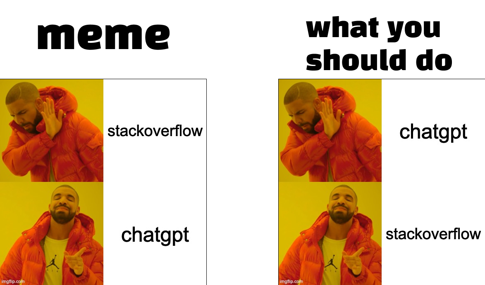
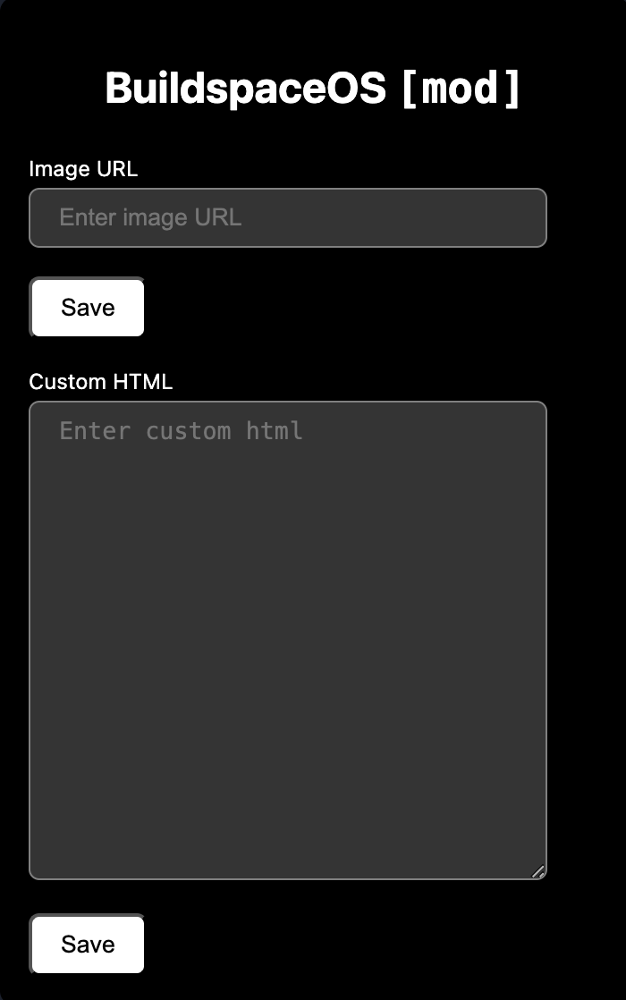
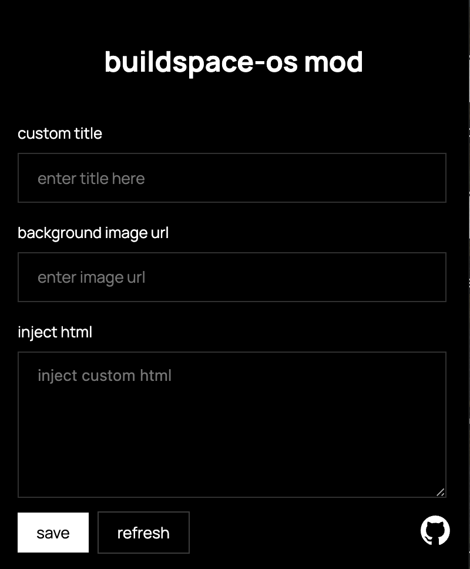
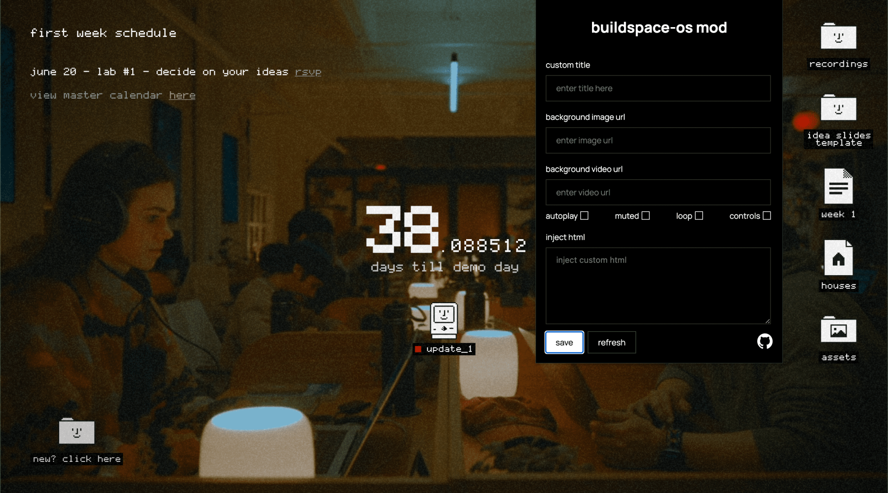

<Callout>
Source code: [github.com/rudrodip/buildspace-os-mod](https://github.com/rudrodip/buildspace-os-mod)

Don't forget to star the repo if you like it.

Demo video [here](#demo)

</Callout>

# backstory

<span className="px-2 py-[2px] rounded text-xs bg-secondary inline-flex mt-5">
  If you are only interested in the mod, you can skip to
  the&nbsp;[technical](#technical-details)&nbsp;part
</span>

I got into [buildspace](https://buildspace.so) season 5, and the kickoff (which was in june 15th, 2024) was amazing. One of the things that I really liked was the [Buildspace OS](https://github.com/buildspace/buildspace-os). It's basically a chrome extension, that replaces your new tab page with the [buildspace home](https://buildspace.so/home) page. It's a great way to keep up with the latest updates, and also to keep track of your progress.

...but, I wanted to change the background video with my wallpaper. So, I looked into the code and found out that it was rendering the [buildspace home](https://buildspace.so/home) page in an iframe. So, I thought, why not just inject my own css and js into the iframe to change the background video.

...and that's what I tried to do.

# emotional rollercoaster

## rabbit hole: part 1

<span
  className="px-2 py-[2px] rounded text-xs bg-primary inline-flex mt-5"
  style={{ color: "hsl(var(--background))" }}
>
  June 15, 2024
</span>

To set some context, I don't know how to make a chrome extension, or how does it even work. I just looked at the code, and hoped on to editing it.

First thing I noticed that it's just rendering the home page in an iframe. So I thought, "alright, i will download the source code, modify it and load it in the iframe instead". So I did that. I downloaded the source code, turns out it's a framer site which is basically react. So modifying it won't result in the change, as react does some client side hydration after intial load.

I still tried it, but it didn't work as expected. So, I kinda gave up on that idea.

## rabbit hole: part 2

<span
  className="px-2 py-[2px] rounded text-xs bg-primary inline-flex mt-5"
  style={{ color: "hsl(var(--background))" }}
>
  Morning, June 18, 2024
</span>

The idea was still buging me, so I gave it a try again. And, I'm a backend nerd, I like to play with server side of things. So, I thought, why not just make a proxy server that will fetch the buildspace home page, and inject my css and js into it. So, I did that. I made a simple hono server, but the same issue persisted as expected. `React hydration`.

## rabit hole: part 3

<span
  className="px-2 py-[2px] rounded text-xs bg-primary inline-flex mt-5"
  style={{ color: "hsl(var(--background))" }}
>
  Noon, June 18, 2024
</span>

I remembered that I had [Tampermonkey](https://www.tampermonkey.net) installed. So, I thought, why not just inject my css and js into the iframe using tampermonkey. So, I did that. I wrote a simple script that will inject my css and js into the iframe. And, it worked. I was able to change the background video with my wallpaper.

Here's the script:

```js
// ==UserScript==
// @name         Modify Buildspace
// @namespace    http://tampermonkey.net/
// @version      0.1
// @description  Replace video with image
// @author       rds_agi
// @match        https://buildspace.so/home
// @match        about:newtab
// @match        about:blank
// @match        chrome://newtab
// @grant        none
// ==/UserScript==

(function () {
  "use strict";

  window.addEventListener(
    "load",
    function () {
      const videoContainer = document.querySelector(
        "div.framer-39t0w6-container"
      );
      if (videoContainer) {
        videoContainer.innerHTML =
          '';
      }
    },
    false
  );
})();
```

I first tried it on the [https://buildspace.so/home](https://buildspace.so/home) page, and it worked. Then I tried it on the new tab page, and it didn't work 😭

It just can't do it for some reason. If anyone knows how to do it, please let me know [@rds_agi](https://x.com/rds_agi).

## rabit hole: part 4

<span
  className="px-2 py-[2px] rounded text-xs bg-primary inline-flex mt-5"
  style={{ color: "hsl(var(--background))" }}
>
  Afternoon, June 18, 2024
</span>

So, I thought alright, if [Tampermonkey](https://www.tampermonkey.net) can work on the home page, surely the chrome extension has the ability to modify the html of the iframe. As I went straight to chatgpt, and asked to write code for my requirements. And it did, it did some modifications to `manifest.json` to add `content.js` file, and wrote the `content.js` file.

<Callout>Every mention of chatgpt is a reference to the gpt-4o model</Callout>

But I was getting an error, `Uncaught DOMException: Failed to read a named property 'document' from 'Window': Blocked a frame with origin "chrome-extension://..." from accessing a cross-origin frame.`

Me: `error`

Chatgpt: `Given the constraints with accessing cross-origin iframe content, let's change our approach. We'll load the https://buildspace.so/home content into an iframe and use a message-passing mechanism to communicate between the main page and the iframe's content script.`

(foreshadowing hour long time waste)

It wrote `background.js`, `iframe.js`, `content.js`, `local.html`, and modified `manifest.json`. And, it still didn't work. I was getting the same error. I was circling around the same issue.

**Did it work? No, it didn't. I was getting the same error.**

So I did what I should've done in the first place. I googled the "modify iframe content by chrome extension", clicked on the first [link](https://stackoverflow.com/questions/74406493/chrome-extension-how-to-manipulate-iframe-contents-from-a-different-subdomain), and i got my [answer](https://stackoverflow.com/questions/74406493/chrome-extension-how-to-manipulate-iframe-contents-from-a-different-subdomain#comment131353703_74406493). It was dead simple, just add `all_frames: true` in the `manifest.json` file.

```json
{
  // ...
  "content_scripts": [
    {
      // ...
      "all_frames": true
    }
  ]
  // ...
}
```

It could've saved me hours if I had googled it in the first place. Ugghh...

I still didn't realize that it was all I needed. So I kept the files as chatgpt wrote, and it worked. I was able to change the background video with my wallpaper. But I started reading and understanding the code, I realized that it was doing nothing but sending random messages from the content script to the background script, and then to the content script of the iframe. I was like, "but why?"

This was my folder structure:

```bash
├── background.js
├── content.js
├── iframe_content.js
├── local_buildspace.html
├── manifest.json
└── tab_override.html
```

I removed all the unnecessary files, and kept only the `manifest.json` and `content.js` file. And, it still worked. I was able to change the background video with my wallpaper.

Later my folder structure looked like this:

```bash
├── README.md
├── content.js
├── manifest.json
└── tab_override.html
```

#### lesson learned

**These AI code assistants suck, they are good for writing boilerplate code, but not for debugging at all.**

**The meme that programmers now will just ask chatgpt rather than going to stackoverflow is not true & useful at all. It's better to google it first, and then ask chatgpt if you can't find the answer**



## moment of truth

<span
  className="px-2 py-[2px] rounded text-xs bg-primary inline-flex mt-5"
  style={{ color: "hsl(var(--background))" }}
>
  Evening, June 18, 2024
</span>

I was happy that I was able to change the background video with my wallpaper. But, I wanted to do more. I wanted to make a UI that lets me insert any image url and it will replace the video with the image. So, I did that. I made a simple UI that lets me insert any image url, and it will replace the video with the image.

I was very excited, so I made another input field that lets me insert any html, and it will replace the video with the html. And, I also added a field for custom title.

This is how it looked:

<div align="center">
  <br />
  
  <br />
</div>

<span
  className="px-2 py-[2px] rounded text-xs bg-primary inline-flex mt-5"
  style={{ color: "hsl(var(--background))" }}
>
  Night, June 18, 2024
</span>

I was superrr happy!! 🥳

I recorded a video of it, and shared it with my friends. I brushed up the repo, added `README.md`, `LICENSE`, and published it on github. Here's the [link](https://github.com/rudrodip/buildspace-os-mod).

## further improvements

<span
  className="px-2 py-[2px] rounded text-xs bg-primary inline-flex mt-5"
  style={{ color: "hsl(var(--background))" }}
>
  Morning, June 19, 2024
</span>

I woke up, and went to the buildspace website for week one updates. One thing that hit me, is the UI/UX of buildspace. It's so clean, truly black n white, zero border radius, look so elegant.

So I thought, as the [buildspace os mod](https://github.com/rudrodip/buildspace-os-mod) is a fork of the origin buildspace os, why not just make it look like the buildspace website. So, I did that. I added some css to make it look like the buildspace website. And, it looked amazing.

<div align="center">
  <br />
  
  <br />
</div>

Oh, one thing, remember the video I made? I shared it with my friends. So, in that video I showed how to inject html into the iframe. And I specifically chose to inject an ifrmae of a youtube embed, you might wonder which video? I chose the [all the way (amv)](https://www.youtube.com/watch?v=zhPayDylYSc) by buildspace. Its a super nice song btw, 101% recommended.

<iframe
  className="w-full rounded-lg"
  height="450"
  src="https://www.youtube.com/embed/zhPayDylYSc"
  title="all the way [AMV]"
  allow="accelerometer; autoplay; clipboard-write; encrypted-media; gyroscope; picture-in-picture; web-share"
  referrerPolicy="strict-origin-when-cross-origin"
></iframe>

So, I thought it would be nice to have a input field that let's me enter any video url, and it will replace the video with the video. So, I did that. I added a input field that lets me enter any video url, and it will replace the video with the video. It worked for regular video urls, but not for youtube embed urls.

<div align="center">
  <br />
  
  <br />
</div>

I wrote some more code to make it work for youtube embed urls, and it worked. I was able to replace the video with the video.

Then, I thought of adding some more fields. Like some checkboxes for video paramteres, like `autoplay`, `loop`, `muted`, `controls`.

I rewrote the whole `popup.js` file, created a separate `style.css` file. I rewrote the `content.js` file, as the chatgpt code was horrible.

After all of this, the UI now looks like this:


You have a dead simple UI. First input field for custom title, second input field for image url, third input field for video url, and some checkboxes for video parameters. And finally a textarea for custom html. You can insert any image url, video url, or html, and it will replace the video with the image, video, or html.

Then there's two buttons, one to save the changes, and one to manually refresh the tab page. I also provided the github [link](https://github.com/rudrodip/buildspace-os-mod) in the footer.

I was very happy with the result 🥹 I recorded a new video for it, and pushed to github.

# demo

Here's the demo video:

<iframe
  className="w-full"
  height="450"
  src="https://www.youtube.com/embed/3I7Lr93ekvg?autoplay=1&loop=1&playlist=3I7Lr93ekvg"
  title="i modded buildspace-os 😝"
  allow="accelerometer; autoplay; clipboard-write; encrypted-media; gyroscope; picture-in-picture; web-share"
  referrerPolicy="strict-origin-when-cross-origin"
></iframe>

# technical details

## how it works

The chrome extension has two main files, `popup.js` and `content.js`. The `background.js` file is important for this discussion.

I wrote a `popup.html` file for the UI of the extension. When user submits the form, `popup.js` first saves the field values in the `chrome.storage.local` and then sends a message to the `content.js` file.

```js
form.addEventListener("submit", (e) => {
  // ...
  chrome.storage.sync.set({
    title,
    image,
    video,
    autoplay,
    loop,
    muted,
    controls,
    html,
  });
  chrome.runtime.sendMessage({
    title,
    image,
    video,
    autoplay,
    loop,
    muted,
    controls,
    html,
  });
});
```

The `content.js` has one main function called `init()`, what it does is on every load, it retrieves the values from the storage and injects those in the iframe.

`content.js` has two listeners, one for the `chrome.runtime.onMessage` and another for the `chrome.storage.onChanged`. Why do we need both of them? Retrieving the values from the storage is an async operation, so we the `chrome.runtime.onMessage` listener is a convinient way to inject the values in the iframe on subsequent changes.

```js
chrome.storage.onChanged.addListener(init);
chrome.runtime.onMessage.addListener((message) => {
  init();
  const reload = someLogic();
  reload && location.reload();
});
```


## setup

You can head over to the [github repo](https://github.com/rudrodip/buildspace-os-mod) to get the code and setup instructions.

# conclusion

It was a very fun experience. I learned a lot, and I'm very happy with the result. I hope you like it too. Don't forget to star the repo if you like it.

If you have any questions, feel free to ask me on [x (formerly twitter)](https://x.com/rds_agi).

Until next time, happy hacking! 🚀
