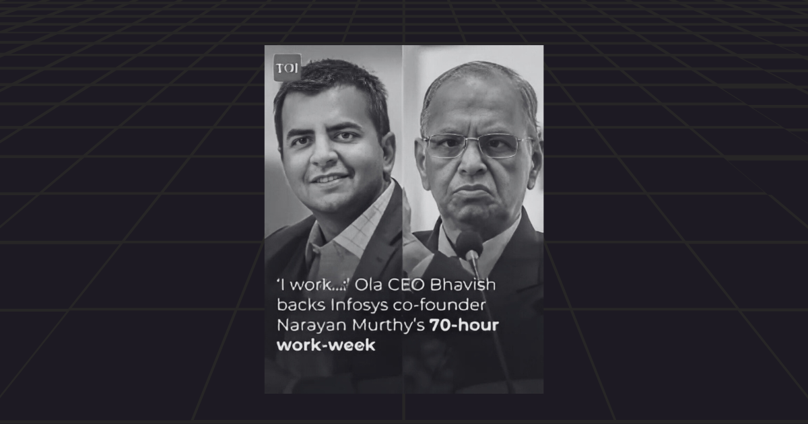
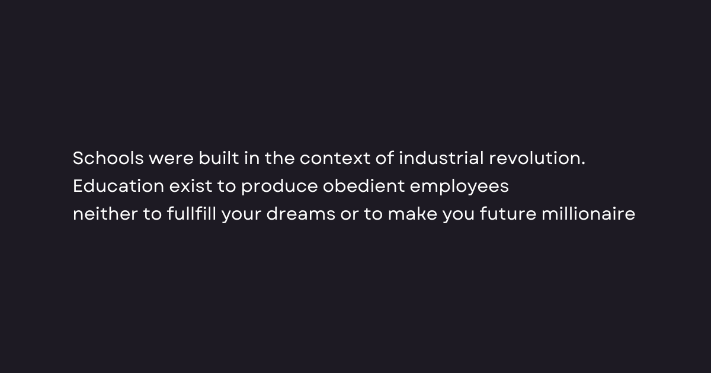

A Struggle&nbsp;&nbsp;↩

Some mornings, I wake up feeling like I could conquer the world. My mind is buzzing with ideas, and there's this electric energy coursing through me. But then, like clockwork, I find myself slipping back into old patterns — rushing through the same mundane tasks that drain my motivation. I often catch myself scrolling through social media, searching for a momentary escape from my reality. I know it's a trap; I can feel the time slipping away. But in that moment, it's so easy to lose myself in the curated lives of others. I stay up late, losing precious sleep, and the next morning, I wake up feeling like a shell of my former self — _tired, unmotivated, and questioning my purpose._

This cycle isn't just a personal battle; it's a reflection of a much larger system at play

Studies show that nearly __70%__ of adults feel unfulfilled in their lives. Society has crafted a world where we're hustling hard.

A Conflict&nbsp;&nbsp;↩

Take Narayana Murthy, co-founder of Infosys, who ignited a massive debate in India when he suggested last October that _"youngsters should be prepared to work for 70 hours a week." He went further to say, "I used to work 85 to 90 hours a week until I retired."_

While Mr.Murthy's work ethic is commendable, it raises questions about the sustainability of such expectations. After all, research indicates that working excessively long hours can lead to burnout, reduced productivity, and even serious health issues.

A study by World Health Organization found that working 55 hours or more per week increases the risk of stroke by 35% and heart disease by 17%.

And it's not just murthy. The CEO of Ola has also pushed for a culture of longer work hours (including weekends), reinforcing the idea that sacrifice is the price of success.

  

<Callout>
The message is clear: to get ahead, we must grind harder with which most of us barely move an inch forward.
</Callout>

We work tirelessly, but the reality is that we often remain in the same spot or only slightly better off. 

We're told to grind harder and hustle more, yet it often feels like we're just running in circle. The truth is _the system is designed to keep the top 1% thriving while the rest of us are left treading water._ We see this everywhere — from tech gaints dictating work culture to corporations prioritizing profits over people.

Complaining about this reality won't change it. We've all been conditioned to believe that success means **fitting into a mold, sacrificing our time and mental health to climb a ladder that feels increasingly rickety.**

Yet, we're told that to reach the hightest levels of our lives, we should just follow the path laid out before us, mimicking the steps of those who came before. But when you look closely, that path often leads to exhaustion, confusion, and a sense of disillusionment.

The bold reality is that the rules are rigged in favor of a select few. The promises of success often come with strings attached — strings that bind us to the grind while those at the top reap the benefits.

A Reflection&nbsp;&nbsp;↩

Ever since childhood, I never focused on the status I should pursue or the wealth I wanted to accumulate, I didn't have the awareness of the reality around me or the greed that often drives others to climb higher on the social ladder.

All I wanted was to feel normal, to be among people and share experiences. I was happy then, and I still find the joy in the simple things, but the relentless grind of adult life weighs heavily on my mind.

  

Unfortunately, it was the place which most of kids spend and their mind draw it's boundaries. There's an internal conflict that arises when you realize the world expects you to play a game — a game of status and wealth, where happiness often feels out of reach. Many never wanted to be under someone else's control, dictated by their demands.

If you love what you do, you'll pour heart and soul into it. Yet, here you feel the creeping shadow of an existential crisis. Each day feels like a battle to maintain hope, and you know you struggle.

Many might not connect with this experience, but I believe this journey is a reflection of larger truth. We live in a society that often condemns the very traits that can lead to a more fulfilling life.

The concepts of Status, Wealth, Awareness, and Greed — are frequently painted in a negative light. Yet, these same traits quietly shape the rules of the world we're all expected to follow.

The chase for status and wealth, the need for awareness and even the pull of greed aren't just concepts to avoid — they are the forces that guide much of what happens around us. We can't escape their influence, no matter how hard we try to ignore them. 

You should realize that your frustation comes from a deep contradiction: **society criticizes what it also encourages**. We're told to work hard, to aim for success, but we're made to feel guilty for wanting more. In this struggle, happiness seems harder to reach, as if pursuing these goals makes us undeserving of it.

A Question&nbsp;&nbsp;↩

Maybe the issue isn't the desire for status or wealth, but the way we think about them. Is it wrong to want more out of life? Or are we trapped in a system that pushes us to chase these things while telling us we shouldn't? It makes me question whether we can ever truly break free from this cycle, or if we're all stuck playing a game we didn't chose?

---

_YOU ARE MEANT FOR MORE_
