<Callout>
  NexusOS is proudly submitted as a project for the `NASA Space Apps Challenge
  2023` by the `Cholo Bangladesh` team. Our platform aims to advance open
  science collaboration and aligns with the goals of `NASA's Open Science
  Initiative` and the `TOPS mission`. We're excited to contribute to scientific
  progress and global cooperation through NexusOS.
</Callout>

---

### Demo Video

  <iframe
    className="w-full"
    src="https://www.youtube.com/embed/xZwEQJX_JbQ?mute=1&autoplay=1&loop=1&playlist=xZwEQJX_JbQ"
    height="450"
    title="NexusOS - Demo Video from 'Cholo Bangladesh' - NASA Space Apps Challenge 2023"
    allow="accelerometer; autoplay; clipboard-write; encrypted-media; gyroscope; picture-in-picture; web-share"
  ></iframe>

## Getting Started

Start with signing up

### Sign Up with GitHub

To start your NexusOS journey, you'll need a GitHub account. If you already have one, simply sign in. If not, sign up for a GitHub account [here](https://github.com/join).

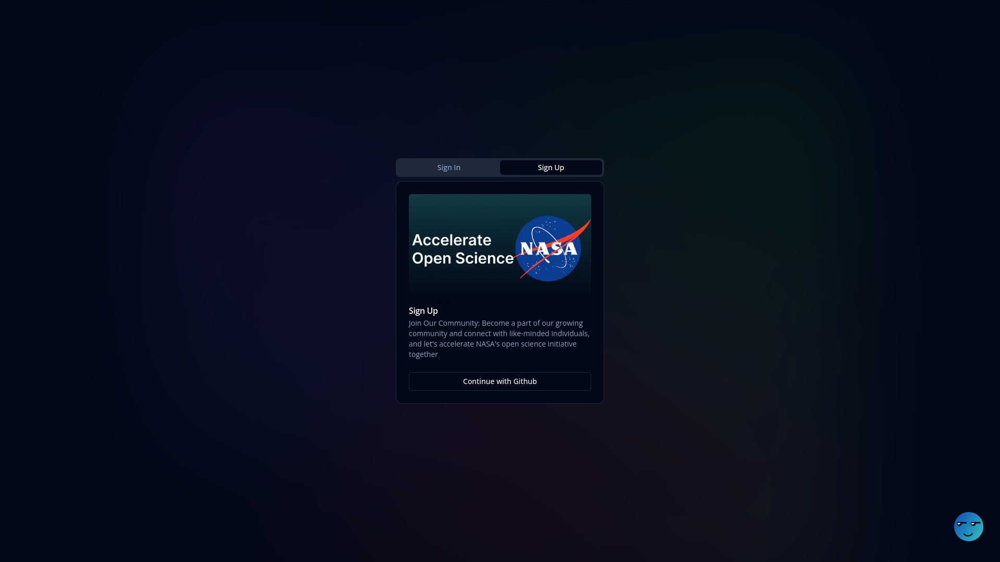

### Update Your Profile

After signing up or signing in, the first step is to update your NexusOS profile. This not only personalizes your experience but also improves your visibility when others are searching for contributors.

- Click on the avatar in the navbar
  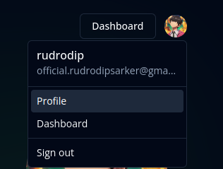
- Click on profile, then you will be redirected to your profile page
  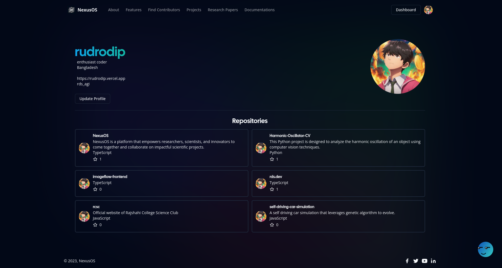
- Click on the `Update Profile` button
  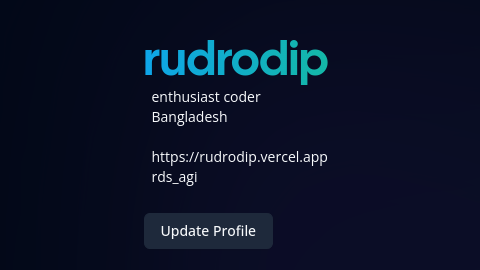

## Exploring NexusOS

Explore

### Dashboard

Once you've signed in and updated your profile, you'll land on your NexusOS Dashboard. Here, you'll find updates, notifications, and quick access to your recent activities.

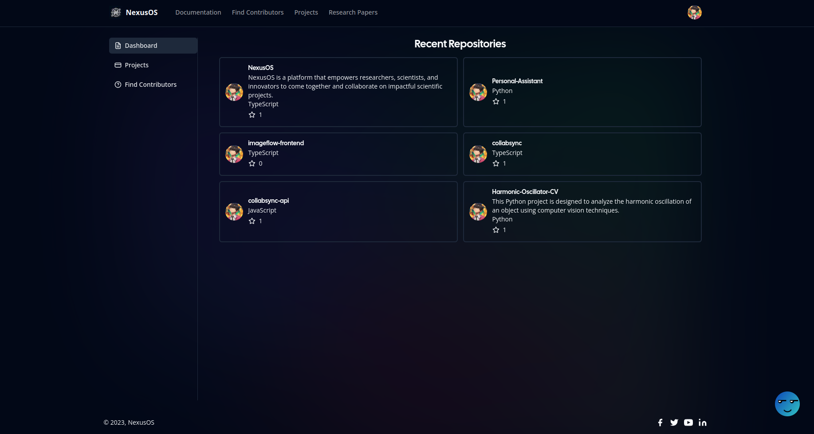

### Projects Page

The "Projects" page is where you can discover a wide range of open science initiatives. Browse projects, read project descriptions, and join those that align with your interests and skills.

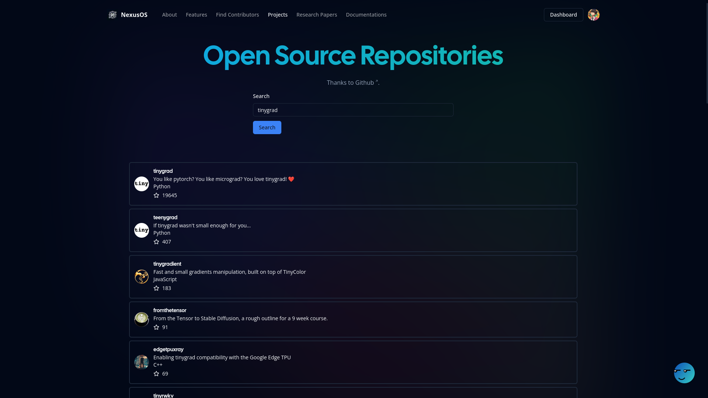

### Find Contributors

If you're looking for collaborators for your project, visit the "Find Contributors" page. Use the search function to find contributors based on their expertise and interests.

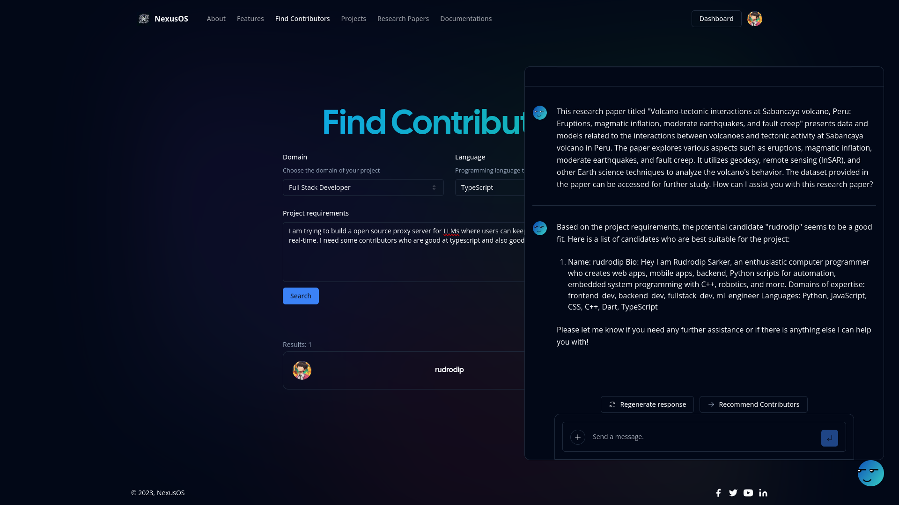

### Chat with Nexbee

Nexbee, our AI companion, is available for assistance. Click on the Nexbee icon to open the chat and get help with various tasks.

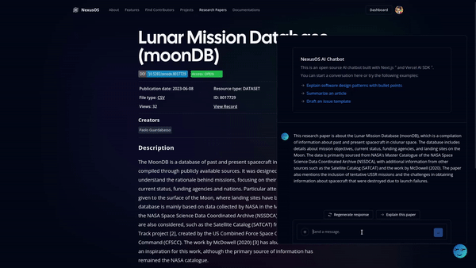

## Research Paper Exploration

Explore research papers

### Research Paper Page

Dive into the world of research papers by visiting the "/paper" page. Search for any topic, click on a paper to read it, and open Nexbee for more insights.

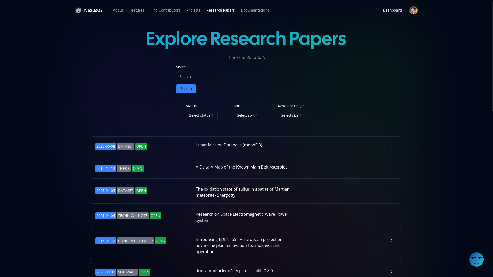

### Explain Research Paper

While reading a research paper, open Nexbee and click on "Explain Research Paper" to get a detailed explanation and better understanding of the content.

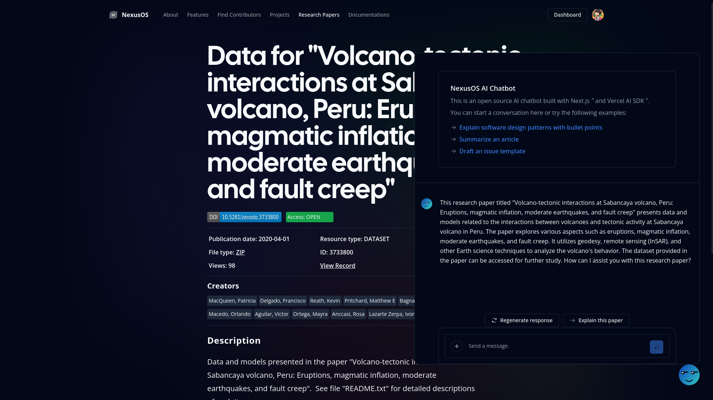

## Repository Exploration

Explore repositories

### Repository Page

If you're interested in a specific repository, you can directly access it by going to "/project/`username`/`repo_name`" or by using the search function. Explore the repository, read its contents, and open Nexbee for additional assistance.

## Finding Contributors

Helps you to find contributors

### Find Contributors Page

Need contributors for your project? Visit the "Find Contributors" page and use the search function to discover potential collaborators. Open Nexbee and click on "Recommend Contributors" to find the right match.

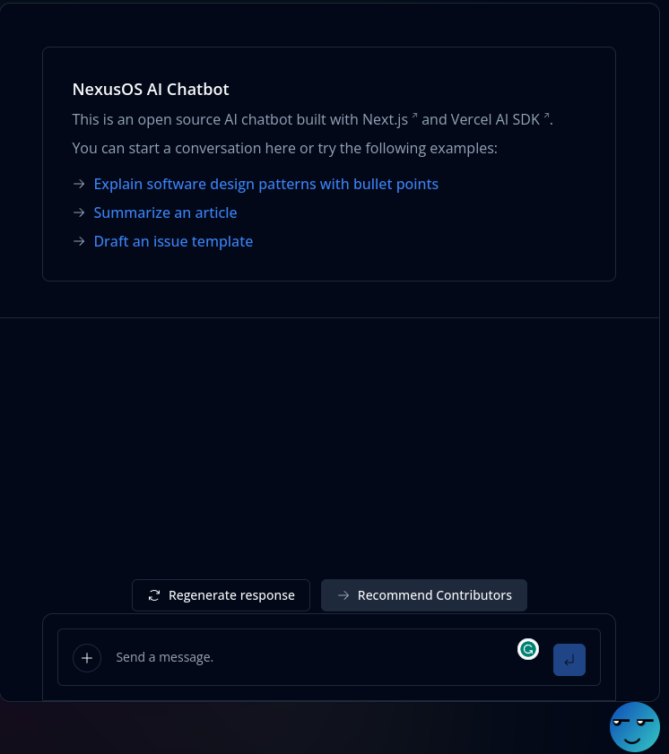
