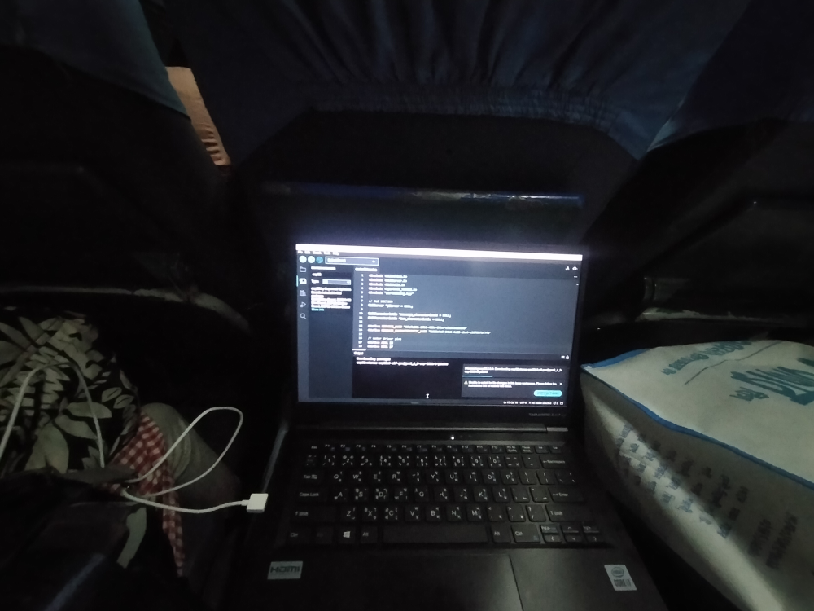
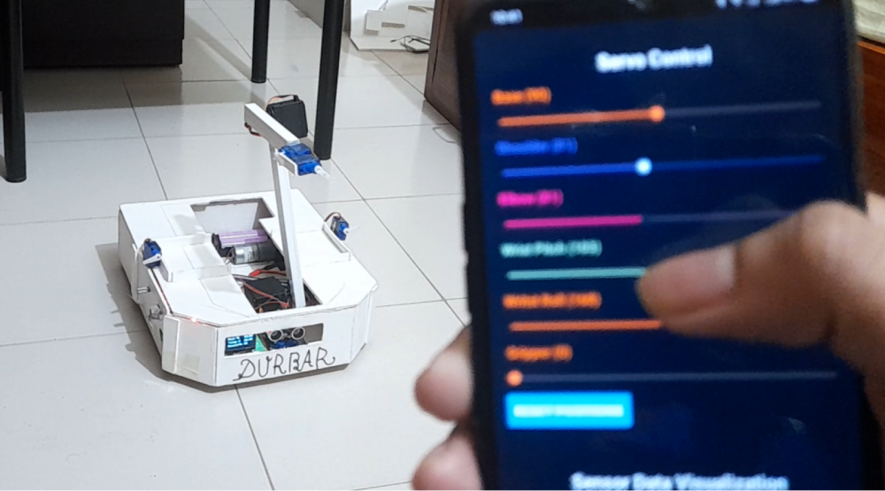
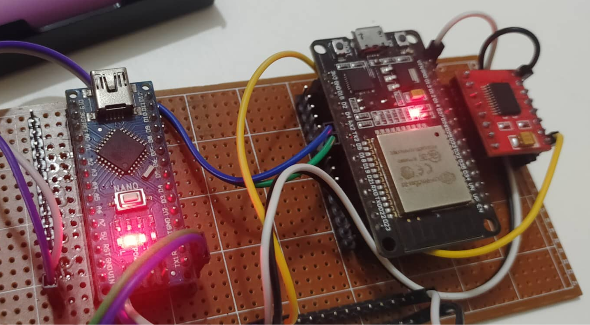
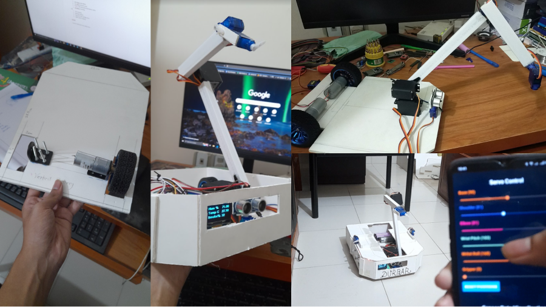

<Callout>
  Durbar was made for [`National Robotics Olympiad, Bangladesh`](https://www.bdro.org/)
  
  Me and my teammate [Sababa Ahmed](https://www.linkedin.com/in/sababa-ahmed-2675a3206) (she named the robot btw) participated in the competition in 2022.
</Callout>

 
<iframe
  className="w-full"
  height="450"
  src="https://www.youtube.com/embed/MpbNkN4FPlk?mute=1&autoplay=1&loop=1&playlist=MpbNkN4FPlk"
  title="🙂"
  allow="accelerometer; autoplay; clipboard-write; encrypted-media; gyroscope; picture-in-picture; web-share"
  referrerPolicy="strict-origin-when-cross-origin"
></iframe>

## Backstory

I've worked with electronics, microcontrollers for a long time, but never made any robots before this. So, when I got the chance to participate in the competition, me in my mind ***hell yeah, let's do this***. Even though I had to make the robot during my final exams, I managed to make it work. I had to work on the robot even journeying to the competition venue. Here's me writing the firmware in train 😅

## Features

- **Controlled by a mobile app**: The robot can be controlled by a dedicated mobile app that I made using React Native.

- **Programmable**: The robot can be programmed to perform various tasks. The robot can be programmed to follow customized workflows using the mobile app.

- **Monitoring**: The robot can be monitored in real-time using the mobile app. The robot sends telemetry data to the mobile app.

- **Sensor data**: The robot has various sensors like ultrasonic sensors, temperature sensor, humidity sensor, smoke sensor etc. The sensor data can be monitored in real-time using the mobile app.

## Tech Stack

- **Microcontrollers**: Arduino Nano, ESP32.
- **Programming Languages**: C++, JavaScript.
- **Mobile App**: React Native.

The robot consists of 2 dedicated microcontrollers.

- **Primary Computer**: The primary computer is an ESP32 microcontroller. The primary computer is responsible for controlling the robot. The primary computer runs a custom [firmware](https://github.com/rudrodip/DurbarDriverProgram) that I wrote in C++.

- **Secondary Computer**: The secondary computer is an Arduino Nano, which is responsible for reading sensor data and sending it to the primary computer. The secondary computer also runs a custom [firmware](https://github.com/rudrodip/DurbarSecondaryComputer) that I wrote in C++.

**Mobile app:** The mobile app is made using React Native. The mobile app communicates with the primary computer using Bluetooth Low Energy (BLE). Here is the [link](https://github.com/rudrodip/DurbarController) to the github repo of the mobile app.

[Robot dataflow diagram](https://app.eraser.io/workspace/mqJ6NZ2ijWhToYhJRTGg?elements=u7TBq_GLRcQcNkHoiRmgwg)

...and here's the progression of the development of the robot.

## Conclusion

The robot was a great learning experience for me. I learned a lot about robotics, microcontrollers, and mobile app development. I also learned how to work under pressure and manage time effectively. I am proud of what I have achieved with the robot. I am looking forward to participating in more robotics competitions in the future.

If you have any questions or feedback, feel free to reach out to me on [X (formerly Twitter)](https://x.com/rds_agi).