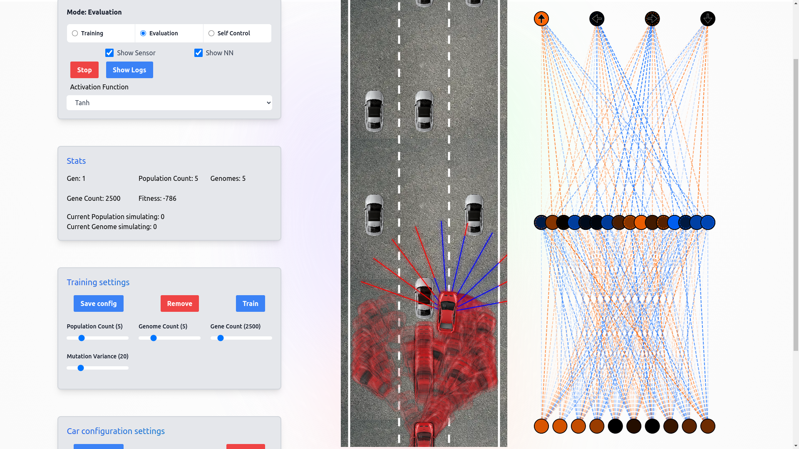

# Overview of the project

An autonomous car simulation that visualizes the behavior of self-driving cars on a road by using custom NEAT algorithm. The simulation includes features like car movement, collision detection, road boundaries, and traffic interaction.

 
<iframe
 className="w-full"
  height="450"
  src="https://www.youtube.com/embed/6um-D7CuUz0?mute=1&autoplay=1&loop=1&start=410"
  title="From Simulations to Solutions: Genetic Algorithms in Autonomous Driving"
  allow="accelerometer; autoplay; clipboard-write; encrypted-media; gyroscope; picture-in-picture; web-share"
  referrerPolicy="strict-origin-when-cross-origin"
></iframe>
 

# Technical Implementation

## Neural Network and Genetic Algorithm

The core of this simulation is a custom NEAT-like (NeuroEvolution of Augmenting Topologies) genetic algorithm implemented in JavaScript. This algorithm evolves neural networks controlling the autonomous vehicles.

Key components:
- **Neural Network:** Input layer (sensor data), hidden layers, output layer (steering, acceleration, braking)
- **Genetic Algorithm:** Population initialization, fitness evaluation, selection, crossover, mutation

This approach enables cars to improve their driving skills over generations, adapting to the road layout and traffic conditions.

## Simulation Environment

Built using HTML5 Canvas and JavaScript within the Next.js framework, the environment consists of:

1. Road System: A single, linear road with three lanes
2. Car Physics: Basic acceleration, deceleration, and steering
3. Sensor System: Virtual sensors detecting road boundaries, other vehicles, and lane positions
4. Collision Detection: Simple algorithm for car-to-car and car-to-boundary collisions
5. Traffic Generation: Random spawning of additional vehicles at simulation start

## Visualization and User Interface

The simulation provides real-time visualization of:
- Car movements and sensor readings
- Neural network structure and activations
- Performance metrics and generation statistics

Users can adjust parameters like mutation rate, population size, and learning rate.

## Challenges and Solutions

1. Performance Optimization: Implemented efficient collision detection and render optimization
2. Balancing Exploration and Exploitation: Used adaptive mutation rates and diverse selection methods

## Future Improvements

Potential areas for enhancement include:
1. More complex road layouts and traffic scenarios
2. Advanced sensor models (e.g., LIDAR simulation)
3. Incorporation of reinforcement learning techniques
4. Further code optimization for better performance

## Conclusion

This Self Driving Car Simulation demonstrates the potential of evolutionary algorithms in autonomous driving systems. By evolving neural networks to navigate a simple road environment, the project provides insights into AI-driven decision-making in traffic scenarios.

The success of this project played a key role in my acceptance to **The Knowledge Society (TKS)** and its scholarship program, highlighting the impact of hands-on projects in showcasing technical skills and innovation potential.

As the field of autonomous driving continues to evolve, projects like this serve as valuable learning tools and stepping stones towards more advanced simulations and real-world applications.