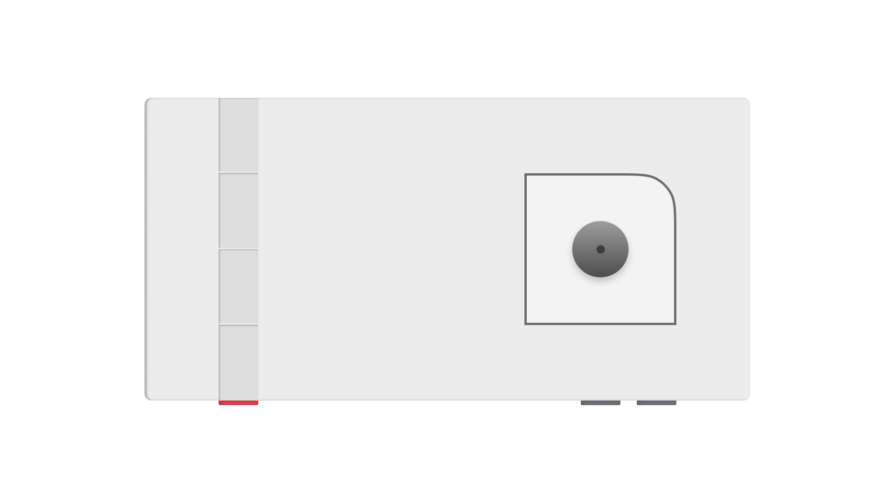
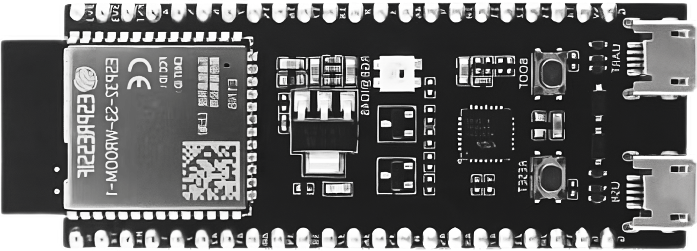
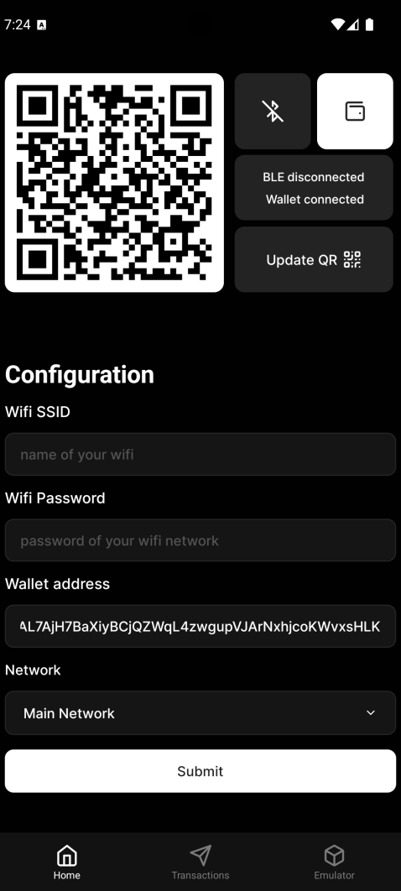
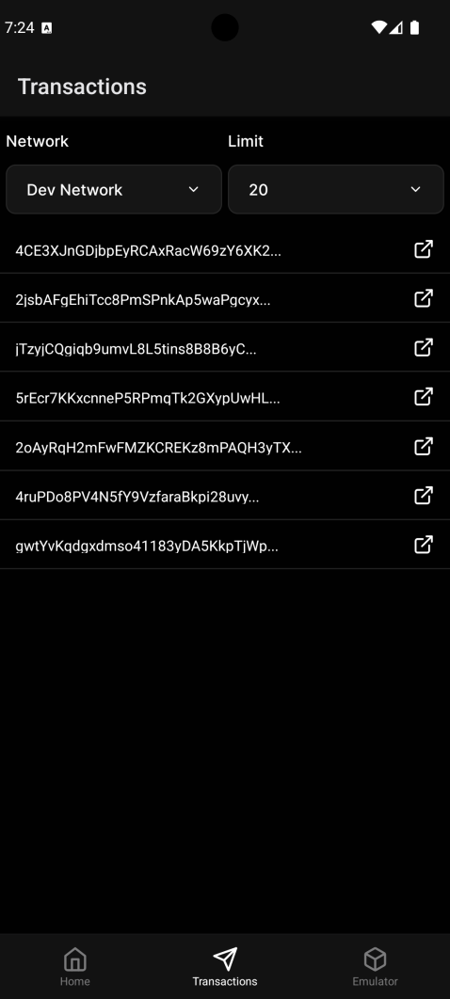
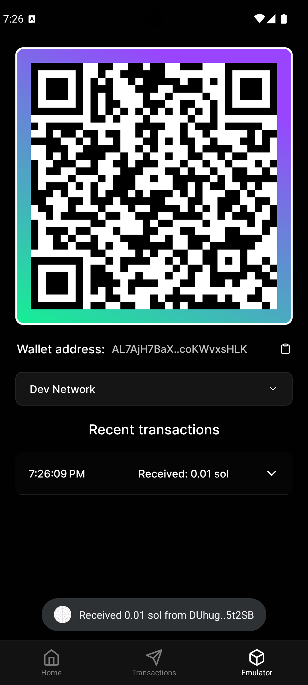

## What is Sonicrypt?

  <iframe
    className="w-full"
    height="450"
    src="https://www.youtube.com/embed/yUm7kYV3p28?mute=1&autoplay=1"
    title="Sonicrypt - the new UX for web3"
    allow="accelerometer; autoplay; clipboard-write; encrypted-media; gyroscope; picture-in-picture; web-share"
    referrerPolicy="strict-origin-when-cross-origin"
    allowFullScreen
  ></iframe>

 
<video
  muted
  autoPlay
  loop
  className="w-full aspect-video"
  poster="./assets/sonicrypt/sonicrypt.png"
>
  <source src="https://firebasestorage.googleapis.com/v0/b/collabsync-yt.appspot.com/o/white-theme.mp4?alt=media&token=34acc426-7e1e-4588-be73-aca560871353" />
</video>

## Products

### 1. Sonicrypt Device

The Sonicrypt Device is the world's first device that provides audio and visual confirmation of successful crypto payments. It aims to enhance the experience for both buyers and sellers involved in these transactions.

#### Features

- Audio confirmation of successful payments
- Visual confirmation of successful payments
- Voice confirmation of successful payments (Sonicrypt Plus & Sonicrypt Pro)
- Support for multiple wallets (Sonicrypt Plus & Sonicrypt Pro)
- Support for multiple blockchains (Sonicrypt Pro)
- Generate QR codes on-the-fly (Sonicrypt Pro)
- Off-chain transactions (Sonicrypt Pro)

#### Sonicrypt is powered by ESP32 microcontroller

#### User Workflow

1. The seller generates a QR code using the Sonicrypt app.
2. The buyer scans the QR code using their wallet app.
3. The buyer sends the payment to the seller.
4. The Sonicrypt device plays a sound and lights up when the payment is confirmed.
5. The seller provides the product to the buyer.
6. The transaction is complete.

#### How it Works

1. The Sonicrypt device connects to the blockchain network (Solana) websocket to listen for account changes.
2. It listens to changes in the seller's wallet address.
3. When a change is detected, it retrieves the last transaction signature.
4. It fetches the transaction details using the signature.
5. If the transaction is successful, the Sonicrypt device plays a sound and lights up.

### 2. Sonicrypt App

The Sonicrypt App is a mobile application that allows users to connect and configure their Sonicrypt devices. It serves as an interface for interacting with the device and managing aspects of the crypto transaction process.

#### Tech Stack

- React Native
- Expo
- Tamagui
- React Native BLE PLX

#### Features of app

- Connect to Sonicrypt device
- View Sonicrypt device status and logs
- Mock Sonicrypt device
- Get transaction details and history
- Get daily transaction summary
- Customize Sonicrypt device settings

#### Built in emulator

 

  
  
  

### Tech stack

- **Firmware**
  - **Language:** C++
  - **Microcontroller:** ESP32-S3
- **Mobile app**
  - **Language:** Typescript, Javascript
  - **Framework:** React Native (Expo)
  - **Libs/SDKs:** Solana web3js, Solana mobile wallet adapter
- **Website**
  - **Language:** Typescript
  - **Framework:** Next.JS
  - **Style:** CSS, Tailwindcss
  - **Animation:** Framer motion
  - **Libs/SDKs:** Solana web3js

  

## Open-Source and No Hidden Costs

Sonicrypt is an open-source project, and we are committed to keeping it that way. The device does not connect to any servers or third-party services, ensuring privacy and transparency. It is a standalone device that you can use without any subscription fees or hidden costs. Both the software and hardware are open-source, allowing you to modify and customize the solution according to your needs.

## Get Involved

We welcome contributions from the community to further enhance the Sonicrypt ecosystem. Whether you're a developer, designer, or an enthusiast, there are numerous ways to get involved. Visit our [GitHub repository](https://github.com/Sonicrypt/sonicrypt) to explore the codebase, submit issues, or contribute to the project.

## Stay Connected

Stay up-to-date with the latest developments, announcements, and updates from the Sonicrypt team by following us on social media:

- Twitter: [@Sonicrypt](https://twitter.com/sonicrypt)

Join our community and be part of the effort to improve crypto transactions!
